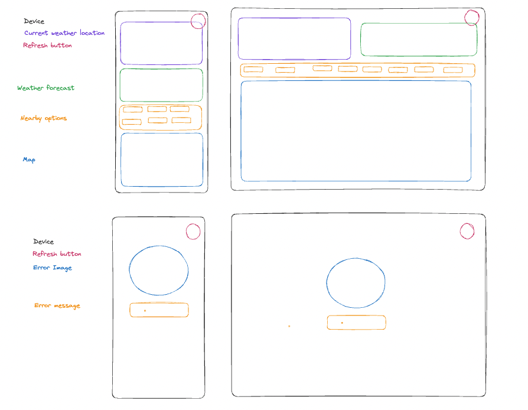
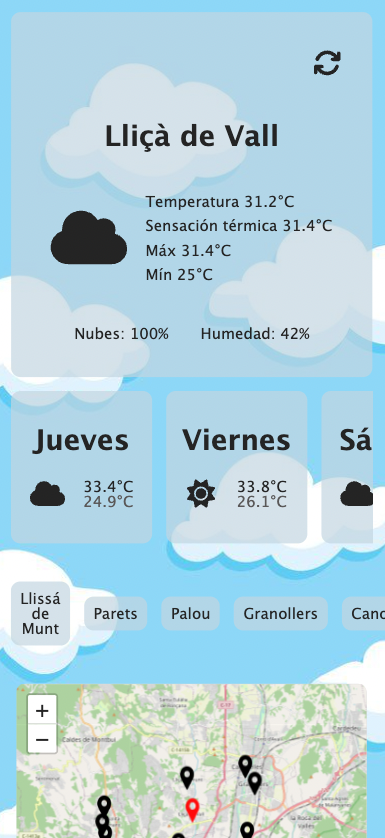
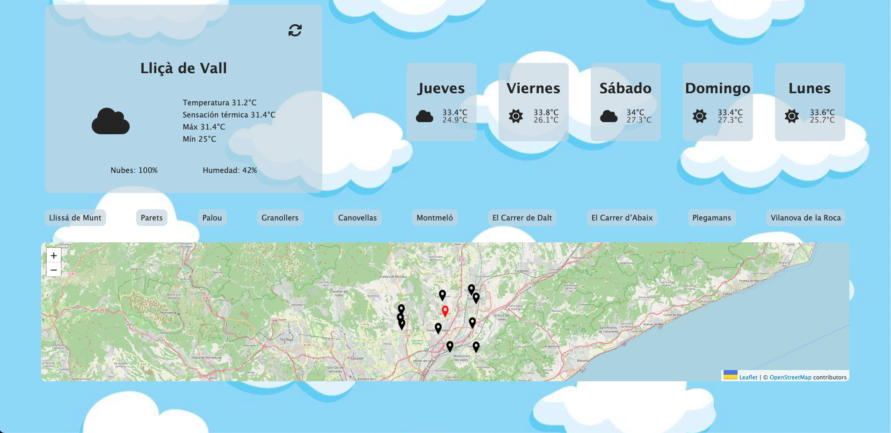
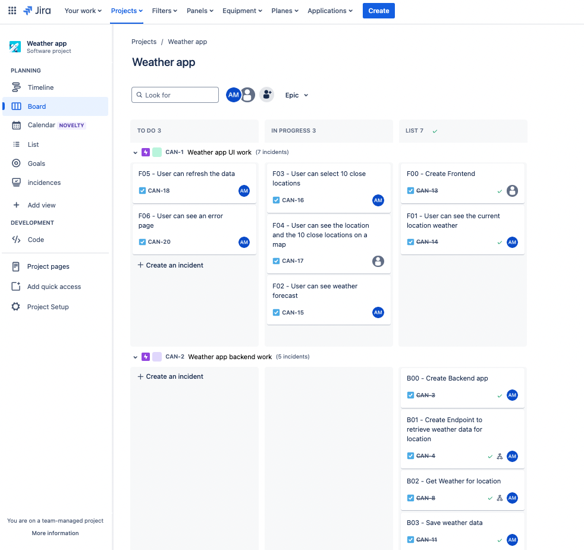
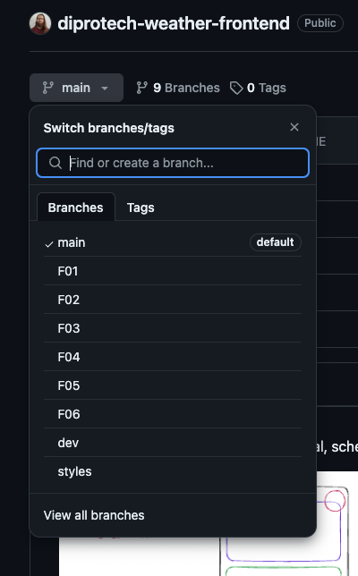

# Diprotech-Weather-Frontend 🌦️

## Welcome

Welcome to Diprotech-Weather-Frontend! This frontend application provides detailed weather information based on the user's current location. Additionally, it offers a 5-day forecast and suggests checking the weather in 10 nearby locations. Users can also view the current location and the 10 suggested locations on an interactive map, with clickable markers for navigation to the desired location.

## Viewport Recommendation 📱

The application is designed with a mobile-first approach but is fully responsive.

## Features 📦

The main page provides the following information:

- Current weather based on the user's location.
- 5-day weather forecast.
- Option to check the weather in 10 nearby locations.
- Interactive map showing the user's location and the 10 nearby locations. Similar to the previous point, users can click on locations to get more information.

In case of a loading delay, the user has a "refresh" button to re-request the ongoing query information.

## Information Displayed

The application displays the following weather information at the main level:

- Location of the weather forecast.
- Current weather represented by an image (sun, clouds, rain, etc.).
- Temperatures: actual, feels like, maximum, and minimum.
- Percentage of clouds and humidity.

For the 5-day forecast:

- Day of the week.
- Forecast represented by an image (sun, clouds, rain, etc.).
- Maximum and minimum temperatures.

## Technologies and Tools Used 💻

- React.
- MapleLeaf.
- FontAwesome (for icons).
- Axios.
- Git.
- Gira.

## Initial Schematic Representation of the App (Pre-Development) and evolution of the APP

In the image below you can see the initial, schematic mocks of the app:

And here are some screenshots of the final result:

I used JIRA to organize the tasks required for this project. I split the work into two main epics: UI and backend work. I then created tickets for each individual task, containing the corresponding user story.

I also created a git branch for each new task and linked the commit to its respective task for better traceability using the ticket code (for example, F06 - User can see an error page):

## How to Start 🏃‍♂️

To run this application locally, follow these steps:

1. Clone this repository.
2. Navigate to the project directory.
3. Install the necessary dependencies: `npm install`.
4. Start the application: `npm start`.
5. Open your web browser and go to [http://localhost:3000](http://localhost:3000) to view the app.
6. To test the application, use the script `npm run start`.

## Views and Routes

- **Main Page (`http://localhost:3000/`)**:

  - **Description**: This is the home page or Main Page. It displays all detailed weather information, including current and 5-day forecasts, as well as nearby locations on the interactive map.

- **Error Page (`http://localhost:3000/error`)**:

  - **Description**: This route is used to handle errors. When an error occurs in the application, the user is redirected to this page, where an error message is displayed and a link is provided to return to the main page.

- **Undefined Routes Redirection**:

  - **Description**: Any other undefined route, such as `http://localhost:3000/dajdklajdkl`, is automatically redirected to the main page.

- **Error Page (`http://localhost:3000/docs`)**:
  - **Description**: Show the documentation about the App, such as components, functions, hooks...

## Notes 📝

- The application uses a context for managing data obtained from the backend, making it accessible from any component and avoiding dependencies between parent and child components.

## Future Improvements 🚀

- Add typing to the application to improve code robustness.
- Integrate additional features based on user feedback, such as a location search functionality.
- Enhance the user experience.

Happy coding! 💻
